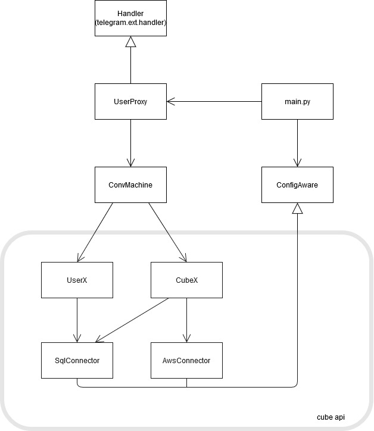
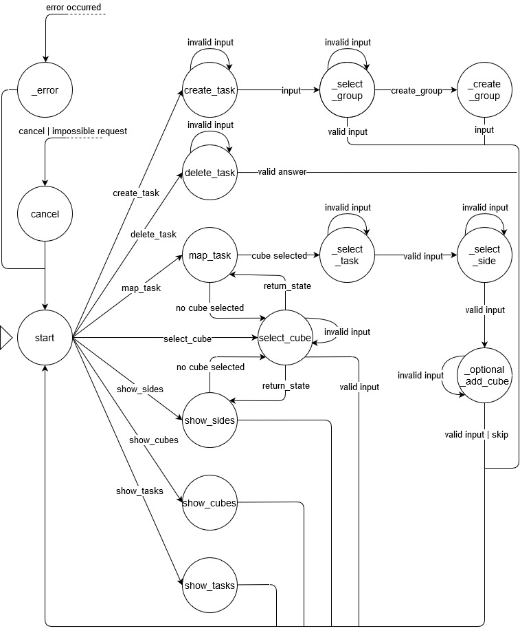
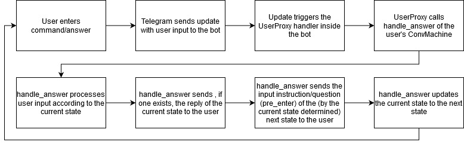
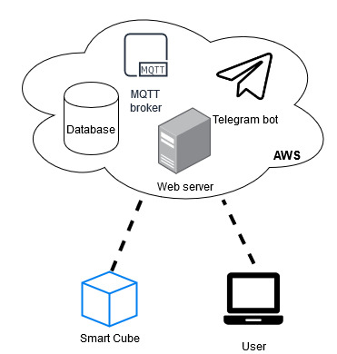

**About arc42**

arc42, the Template for documentation of software and system
architecture.

By Dr. Gernot Starke, Dr. Peter Hruschka and contributors.

Template Revision: 7.0 EN (based on asciidoc), January 2017

© We acknowledge that this document uses material from the arc 42
architecture template, http://www.arc42.de. Created by Dr. Peter
Hruschka & Dr. Gernot Starke.

.. _section-introduction-and-goals:

Introduction and Goals
======================
.. __what_is_the_smart_cube:

What is the Smart Cube?
-----------------------
The project is all about the so called Smart Cube. That is a device with n sides which supports people with their time management. 
To do so you can assign any custom task like cooking, eating, coding, debugging, etc. to each side of the cube and then, when you 
are doing one of these tasks, you simply turn the cube onto the side, you assigned this task to before and after finishing, you turn
the cube to another side and the cube measures the time you spent on that task and later creates you statistics about how much time 
you have spent on which task for example. 

.. __our_task:

Our Task
--------
Our contribution to the whole Smart Cube project is the creation of an API to communicate with the cube and the database, which also has 
to be created, the creation of a simple Web-GUI to view some statistics of the cube and finally the implementation of a telegram bot to 
configure and work with the cube.  

.. __how_to_start:

How to start
------------
To see and try the results of the project, the database, the GUI and the bot have to be running in the cloud and the prototype of the cube 
should be connected to a network. If all of this is done, you can connect to the GUI, create a account (with your telegram username) if you 
have not done so yet and connect to the telegram bot where you have to enter "[/]start" to start interacting with the cube.

.. __requirements_overview:

Requirements Overview
---------------------
As the cube should be a modern and flexible IoT device, the communication will be cloud based, in this case using AWS. For lightweight and 
fast interaction with the cube, the protocol MQTT is used. And finally considering the expected flexibility and the prototyp state of the 
project, the software components will be implemented in python.

.. __quality_goals:

Quality Goals
-------------
At the time of this project, the whole Smart Cube project is still quite at the beginning. That is why the main quality goal of this project 
is flexibility for future ideas and changes in the whole project. Apart from that another goal is to create a simple, easily expandable and 
correctly working software package for interaction with cube and database, including the telegram bot.
table!

.. _section-system-scope-and-context:

System Scope and Context
========================
AWS: To connect to the AWS servers with python, the module AWSIoTPythonSDK will be used
Database: As the database will also run on AWS, the there available postgresql will be used
Telegram: For the bot to interact with telegram, the module python-telegram-bot will be used
Web-GUI: The small web-GUI will also be implemented in python with the help of the django framework
table!

.. _section-solution-strategy:

Solution Strategy
=================
As our project consists of four individual parts, we had to find solution strategies for those four different sub-projects:

.. ___api:

API
---
The API to interact with the cube for now consists of four basic classes. There is one to interact directly with the database and one 
to handle the connection to the AWS. Built on those two classes there is one class which represents the cube and handles operations 
connected directly to the cube like mapping a task onto a side of the cube. The other class represents the user and deals with requests 
only connected to the user like creating tasks. These two classes are the interface to be used for any GUI, Application, etc. to interact 
with the cube and the database.

.. ___database:

Database
--------
The database currently consists of five tables. One to hold the users, one for the cubes, one for the tasks, one for the cube side mappings 
and one to store the activities measured by the cube. To create a quiet structured way for the user to manage his tasks, the decicions were 
made that on the one hand a group has to contain at least one task, so the user can group his tasks by group and on the other hand a task 
can contain an optional cube_id so the user can also group his tasks by cube.

.. ___telegram_bot:

Telegram Bot
------------
At first, the idea was to create the bot based on the class ConvHandler of the used telegram API. But as this class in the end was to 
restrictive, the bot is now made up of two classes. The first one is a custom handler for telegram updates to deal with multiple users and 
the actual conversation is handeled by a own state machine.
no registration, username telegram = username db

.. ___web_gui:

Web-GUI
-------
As for the architecture pattern Django itself uses the MVC Pattern or in Django’s case a MTC Pattern.
All of our Databases is written down in the models file which resembles the Models in MVC. As well as some extra information.
For our view we have the templates which are written down in html including some java script and Django internal syntax.
The Controller which does almost all the computing work, is located in the views.py file.
It passes all the information to the templates.
The Websites itself has some simple functions, logging in, signing up. As well as editing your Cubes. Along with these Basics functions 
it shows you a few charts which resembles your time spend on the Tasks and Groups.

.. _section-building-block-view:

Building Block View
===================
.. image:: images/Database.pdf
sql conncector

cubeX + userX

Runtime View
============

.. ___bot_conversation:

Bot Conversation
----------------

To understand the behavior of the bot better, this shows the general procedure of how the user bot interaction works inside the telegram 
bot.

.. ___transmission_to_cube

Transmission to Cube
--------------------
json example
cube sends only task_name, rest callback cubeX
mqtt topics

Deployment View
===============

Like mentioned in the requirements section, the system should be mainly cloud based, so in the end, the database, the MQTT broker, the 
server for the Web-GUI and the bot should all run in the AWS cloud and the cube and the user communicate via the cloud with eachother. So 
the cube should communicate with the MQTT broker via MQTT and the user can use the Web-GUI or the telegram bot to interact with the cube. 
These two applications then also can communicate via the cube API with the MQTT broker and on this way interact with the cube. 
As for this project itself it was not necessary to let all of this run in the cloud, the Web-GUI and the bot still ran on our local devices 
for easier testing.

.. _section-design-decisions:

Design Decisions
================
As this project is only a small part of the whole Smart Cube project and one of the goals was to create a very flexible software system, 
there were no decicions with too much impact made. The only rather enduring decicions made concern the structure of the database and the 
format of the to the cube transmitted json file itself, because there are already many parts in the software that depend on these 
structures, so changes there could cause a rising number of modifications to be necessary.
db special, modular for flexibility
json
