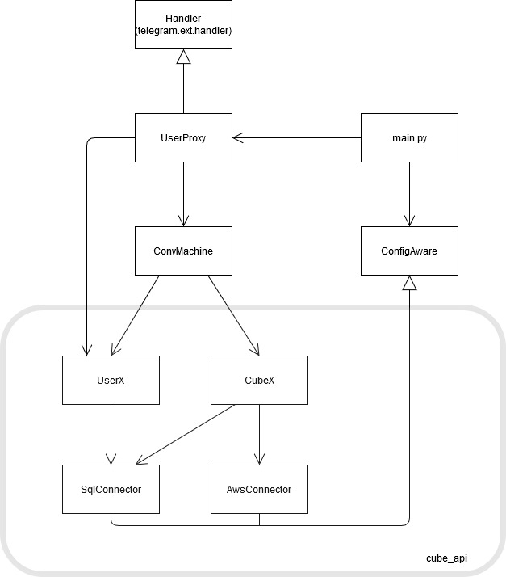

#####################
Project Documentation
#####################

Documentation of the short-term project at OPNU in Odessa

Project: Smart Cube

Project Participants:

+------------------------+--------------+
|Participant             |Student Number|
+========================+==============+
|Kilian Drechsler        |1111111       |
+------------------------+--------------+
|Maximilian Diesenbacher |2050504       |
+------------------------+--------------+
|Florian Wöster          |2222222       |
+------------------------+--------------+
|Matthias Moser          |3333333       |
+------------------------+--------------+

.. _section-introduction-and-goals:

Introduction and Goals
======================
.. __subsection-what-is-the-smart-cube:

What is the Smart Cube?
-----------------------
The project is all about the so called Smart Cube. That is a device with n sides which supports people with their time management. 
To do so you can assign any custom task like cooking, eating, coding, debugging, etc. to each side of the cube and then, when you 
are doing one of these tasks, you simply turn the cube onto the side, you assigned this task to before and after finishing, you turn
the cube to another side and the cube measures the time you spent on that task and later creates you statistics about how much time 
you have spent on which task for example. 

.. __subsection-our-task:

Our Task
--------
Our contribution to the whole Smart Cube project is the creation of an API to communicate with the cube and the database, which also has 
to be created, the creation of a simple Web-GUI to view some statistics of the cube and finally the implementation of a telegram bot to 
configure and work with the cube. For testing we were provided with a microcontroller with two buttons connected to a small display to 
simulate an actual cube.

.. __subsection-how-to-start:

How to start
------------
To see and try the results of the project, the database, the GUI and the bot have to be running in the cloud and the prototype of the cube 
should be connected to a network. If all of this is done, you can connect to the GUI, create a account (with your telegram username) if you 
have not done so yet and connect to the telegram bot where you have to enter "[/]start" to start interacting with the cube.

.. __subsection-requirements-overview:

Requirements Overview
---------------------
As the cube should be a modern and flexible IoT device, the communication will be **cloud based**, in this case using AWS. For lightweight 
and fast interaction with the cube, the **protocol MQTT** is used. And finally considering the expected flexibility and the prototyp state 
of the project, the software components will be implemented in **python**.

.. __subsection-quality-goals:

Quality Goals
-------------
+------------------------+---------------------------------------------------------------------+
|Quality goal            |Motivation and Explanation                                           |
+========================+=====================================================================+
|Flexibility             |At the time of this project, the whole Smart Cube project is still   |
|                        |quite at the beginning. That is why one main quality goal of this    |
|                        |project is to create a flexible and easily expandable software for   |
|                        |future ideas and changes in the whole project .                      |
+------------------------+---------------------------------------------------------------------+
|Functionality and       |The bot and the web GUI should offer a number of basic functions to  |
|Correctness             |interact via a correctly funtioning API with the cube.               |      
+------------------------+---------------------------------------------------------------------+
|Usability               |The bot and the web GUI should be a simple and easy to understand    |
|                        |interface for the user to work with the cube.                        |
+------------------------+---------------------------------------------------------------------+

.. _section-system-scope-and-context:

System Scope and Context
========================
.. __subsection-external-interfaces

External Interfaces
-------------------
+------------------------+------------------------------------------------------------------------+
|External System         |Used Interface                                                          |
+========================+========================================================================+
|AWS                     |AWSIoTPythonSDK python package                                          |
+------------------------+------------------------------------------------------------------------+
|Telegram                |python-telegram-bot python package                                      |
+------------------------+------------------------------------------------------------------------+
|Database                |psycopg2 python package to communicate with the database vial postGreSql|
+------------------------+------------------------------------------------------------------------+

.. __subsection-other-dependencies

Other Dependencies
------------------
+------------------------+------------------------------------------------------------------------+
|System                  |Used Component                                                          |
+========================+========================================================================+
|Web GUI                 |Django webframework for python                                          |
+------------------------+------------------------------------------------------------------------+

.. _section-solution-strategy:

Solution Strategy
=================
.. __subsection-api:

API
---
The API to interact with the cube for now consists of four basic classes. First there is the SqlConnector which interacts directly with the 
database and second the AwsConnector to handle the connection to the AWS and therefore to the cube. Built on those two classes there is the 
class CubeX which represents a cube and handles operations connected directly to the cube like connecting to it or mapping a task onto a 
side of the cube. The other class, called UserX, represents the user and deals with requests only connected to the user like creating tasks. 
These two classes make up the interface to be used by any GUI, Application, etc. to interact with the cube and the database like our bot.

.. __subsection-database:

Database
--------
The database currently consists of five tables. One to hold the users, one for the cubes, one for the tasks, one for the cube side mappings 
and one to store the activities measured by the cube. Within this structure, the cubes and tasks are each bound to a user, a task 
additionally contains a group, which toghter with the user and the name of the task identify it. As a group has to contain at least one task, 
all groups can be found with the tasks. The table for the cube sides identifys a side via a side number and the cube and holds the task that 
was mapped onto the side. Finally the measured activities, called events, contain the task and a start and end time.

.. __subsection-telegram-bot:

Telegram Bot
------------
At first, the idea was to create a bot based on the class ConvHandler of the used telegram API. But as this class in the end came out to be 
too restrictive for a simple and flexible bot, the bot is now made up of two classes. The first one is a custom handler for telegram updates 
to handle multiple users called UserProxy and the actual conversation is handeled by a own state machine implemented in the class 
ConvMachine.

.. __subsection-web-gui:

Web-GUI
-------
As for the architecture pattern Django itself uses the MVC Pattern or in Django’s case a MTC Pattern.
All of our Databases is written down in the models file which resembles the Models in MVC as well as some extra information.
For our view we have the templates which are written down in html including some java script and Django internal syntax.
The Controller which does almost all the computing work is located in the views.py file. It passes all the information to the templates.
The Website itself has some simple functions like logging in, signing up or editing your cubes. Along with these basics functions 
it shows you a few charts which resembles your time spend on the tasks and groups.

.. _section-building-block-view:

Building Block View
===================

This database then can be accessed with the functions of the class SqlConnector

Using the two classes SqlConnector and AwsConnector, which directly interact with the database and AWS, the classes UserX and CubeX 
provide all necessary functions for working with the cube and the database for any application. 

.. _section-runtime-view:

Runtime View
============
.. __subsection-mqtt-transmission:

MQTT Transmission
-----------------

While the programm is running, the cube and any user interface via CubeX via the AwsConnector exchange data if there was a relevant change 
done by the user. In our case this is mainly when a task is mapped. Then CubeX initiates the transmission of a .json file with the 
following example structure to the cube:

{"side":  

    [{"side": 0, "cube_id": 1, "task": "netflix", "group": "home"},   

    {"side": 1, "cube_id": 1, "task": "sleeping", "group": "home"},  

    {"side": 2, "cube_id": 1, "task": "eating", "group": "home"},  

    {"side": 3, "cube_id": 1, "task": "debugging", "group": "work"},  

    {"side": 4, "cube_id": 1, "task": "coding", "group": "work"},  

    {"side": 5, "cube_id": 1, "task": "nothing", "group": "home"}]  

}  

On the other side the cube sends a .json file containing the name of the task, which just had been finished if it is turned. This file is
then processed by the for that written callback function task_message_action.

.. __subsection-bot-conversation:

Bot Conversation
----------------

To understand the behavior of the bot better, this shows the general procedure of how the user bot interaction works inside the telegram 
bot.

.. __subsection-bot-state-machine:

Bot State Machine
-----------------
.. image:: images/StateMachine.jpg
In more detail, the bot follows this state machine while communicating with the user.

.. _section-deployment-view:

Deployment View
===============
.. image:: images/Deployment.jpg
Like mentioned in the requirements section, the system should be mainly cloud based, so in the end, the database, the MQTT broker, the 
server for the Web-GUI and the bot should all run in the AWS cloud and the cube and the user communicate via the cloud with eachother. So 
the cube should communicate with the MQTT broker via MQTT and the user can use the Web-GUI or the telegram bot to interact with the cube. 
These two applications then also can communicate via the cube API with the MQTT broker and on this way interact with the cube. 

.. _section-design-decisions:

Design Decisions
================
.. __subsection-database:

Database
--------
One of the first fundamental decicions was the overall structure of the database itself becuase this has an impact on many other software 
components. Among the most discussed questions was how to create a structured way for the to manage his tasks. In the end, the decicions 
were made that on the one hand a group has to contain at least one task, so the user can group his tasks by group and on the other hand a 
task can contain an optional cube_id so the user can also group his tasks by cube.

.. __subsection-user-handling:

User Handling
-------------
Another question was, wether a new user should be able to register a account via the telegram bot. But because there is no convenient way 
to enter a password securely in telegram, a user now first has to register himself in the Web-GUI and then he can use the bot properly with 
his cubes. To simplify the implementation at this point, for now the username at the registration has to be the same as the user's username 
within telegram.

.. __subsection-state-naming-conventions:

State Naming Conventions
------------------------
Finally an important point when trying to expand the state machine for the bot are the appointed naming conventions for the states:
naming conventions for the states:
* state name starts with _ if the state cannot be accessed directly by the user (= is not a command)

* if possible the state ends with the by its function affected object (e.g. select_cube, create_task, select_group)

* if pre-enter shows the user a list to select from and an empty list is allowed, the pre-enter must contain the word "or" (e.g. see _optional_add_cube, _select_group)

.. _section-code-documentation-cubex:

Code Documentation CubeX
========================
.. __subsection-main:

main module
-----------

.. automodule:: main
   :members:
   :undoc-members:
   :show-inheritance:

.. __subsection-config_aware:

config_aware module
-------------------

.. automodule:: config_aware
   :members:
   :undoc-members:
   :show-inheritance:

.. __subsection-cube_api:

cube_api
--------
.. ___subsubsection-cubeX:

cubeX module
^^^^^^^^^^^^

.. automodule:: cube_api.cubeX
   :members:
   :undoc-members:
   :show-inheritance:

.. ___subsubsection-userX:

userX module
^^^^^^^^^^^^

.. automodule:: cube_api.userX
   :members:
   :undoc-members:
   :show-inheritance:

.. ___subsubsection-ext_conn:

ext_conn
^^^^^^^^

.. ____subsubsubsection-aws_connector:

aws_connector module
""""""""""""""""""""

.. automodule:: cube_api.ext_conn.aws_connector
   :members:
   :undoc-members:
   :show-inheritance:

.. ____subsubsubsection-sql_connector:

sql_connector module
""""""""""""""""""""

.. automodule:: cube_api.ext_conn.sql_connector
   :members:
   :undoc-members:
   :show-inheritance:

.. __subsection-telegram_bot:

telegram_bot
------------
.. ___subsubsection-user_proxy:

user_proxy module
^^^^^^^^^^^^^^^^^

.. automodule:: telegram_bot.user_proxy
   :members:
   :undoc-members:
   :show-inheritance:

.. ___subsubsection-conv_machine:

conv_machine module
^^^^^^^^^^^^^^^^^^^

.. automodule:: telegram_bot.conv_machine
   :members:
   :undoc-members:
   :show-inheritance:

